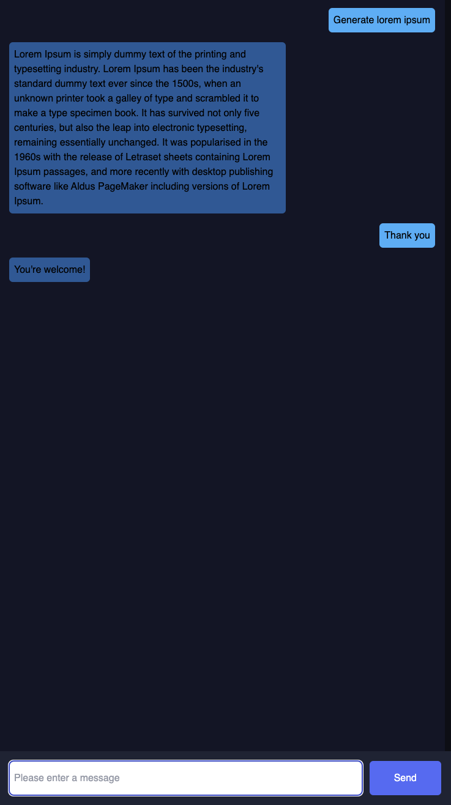

# Simple Chat
A simple chat fullstack web application using Open AI built with React and Node JS.

## Prerequisites
Make sure you have installed the following on your machine:
- [Node](https://nodejs.org/en/download/package-manager) (at least v18+ or higher)
```bash
# install node link: https://nodejs.org/en/download/package-manager
# On a Mac use the following command

# installs nvm (Node Version Manager)
curl -o- https://raw.githubusercontent.com/nvm-sh/nvm/v0.39.7/install.sh | bash

# download and install Node.js (you may need to restart the terminal)
nvm install 18

# verifies the right Node.js version is in the environment
node -v # should print `v18.20.3`

# verifies the right NPM version is in the environment
npm -v # should print `10.7.0`
```
> Note: if you aren't using Mac, the link above 👆🏽 provides you various ways to install node on your machine

- [pnpm](https://pnpm.io/) - is the package manager used in this project
- [bit cli](https://bit.dev/docs/getting-started/installing-bit/installing-bit/)
```bash
npx @teambit/bvm install
# you need to reload your bash profile to be able to access
```

## What's inside?
This project used [@teambit/bvm](https://bit.dev/) (bit) for bootstrapping the monorepo. You can read more about this tool on their [documentation page](https://bit.dev/docs/intro/)


## Up and running
- Install dependencies
```
bit install
```
- Check if the apps are listed
```bash
bit app list # should show 2 apps (chat-ui and chat-service)
```
- Run the application
```
# backend
bit run chat-service
# frontend
bit run chat-ui
```


